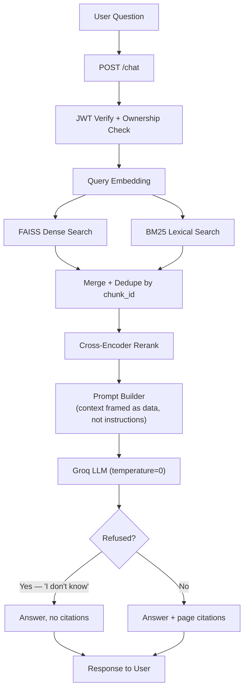
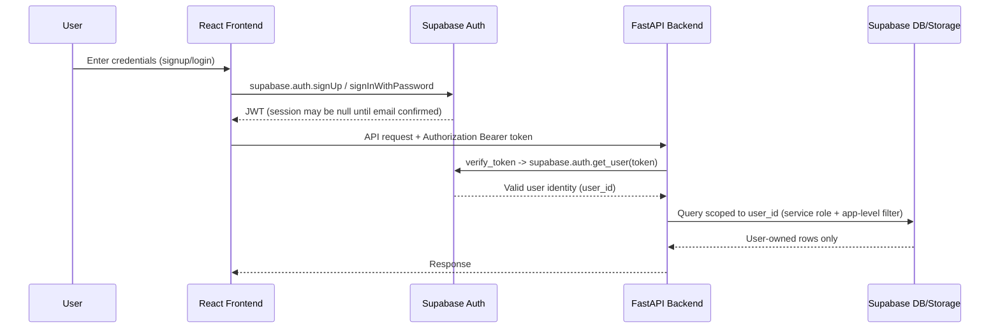
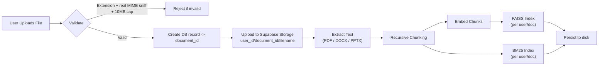
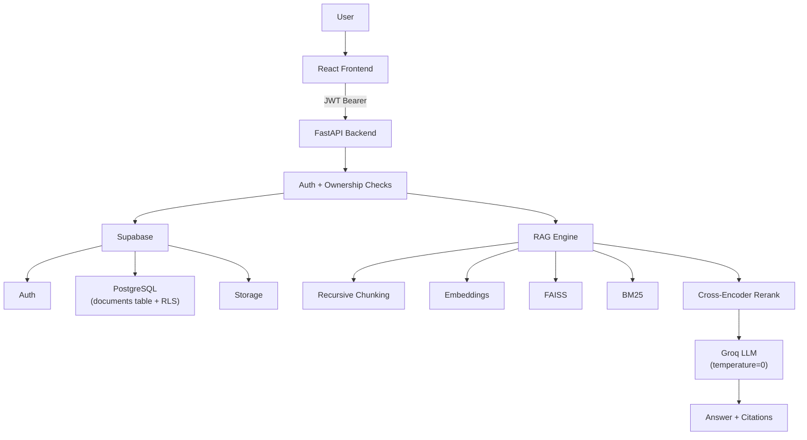

# RAG Assistant

A production-hardened, multi-user Retrieval-Augmented Generation (RAG) application that lets users upload documents (PDF/DOCX/PPTX) and chat with them, getting AI-generated answers grounded in the document with clickable page citations.

The system combines hybrid retrieval (dense + lexical), cross-encoder reranking, JWT authentication, per-user data isolation, and a set of deliberate hardening measures against prompt injection and markdown-based exfiltration into a single deployable pipeline.

---

## Features

### Authentication & User Management
- Email/password signup & login via Supabase Auth, with email confirmation enforced through a custom SMTP provider (not Supabase's default rate-limited sender)
- Client-side email format validation before any request is sent
- JWT bearer tokens verified against Supabase on every protected route
- Full per-user data isolation — every document query, storage path, and vector index is scoped to `user_id`
- Duplicate-account detection with a clear message instead of a silent failure

### Document Management
- Upload PDF, DOCX, and PPTX (10MB cap)
- Extension allowlist **and** real MIME-type sniffing on the file bytes (not just trusting the extension or client-supplied `Content-Type`)
- Per-user duplicate-filename check
- Files stored in Supabase Storage, namespaced `user_id/document_id/filename`
- File access via short-lived (60s) signed URLs, never raw storage paths
- Switch which document a chat is chatting with, or filter chats by source document

### RAG Pipeline
- Text extraction per page/slide (PDF, DOCX, PPTX)
- **Recursive character chunking** — splits on paragraph → line → sentence → word boundaries before ever falling back to a hard character cut, so chunks don't sever mid-sentence the way naive fixed-offset slicing does
- Sentence-embedding generation (`sentence-transformers/all-MiniLM-L6-v2`)
- **Hybrid retrieval**: FAISS dense similarity search + BM25 lexical search, merged and deduplicated by chunk ID
- **Cross-encoder reranking** (`cross-encoder/ms-marco-MiniLM-L-6-v2`) on the merged candidate set for higher-precision top-k
- Deterministic answer generation (`temperature=0`) via Groq — same context always produces the same phrasing
- Page-level source citations, deduplicated and capped, correctly **suppressed when the model refuses to answer** (see Security below)
- Per-document FAISS index + chunk metadata persisted to disk, reloaded instead of rebuilt on every chat
- Per-session answer cache for repeated identical questions

### Chat Features
- Multiple conversations per user, each bound to the document it was created against
- Chat history persisted **client-side** (`localStorage`, scoped per logged-in user, synced across tabs) — survives a page refresh but is local to the browser, not synced across devices
- Rename, delete, and re-source (change which document a chat targets) conversations
- Search/filter conversations by title or source document
- Per-chat question limit (20) with a friendly cutoff message
- Markdown-rendered answers (bold, lists, headings, code, links) instead of raw `**asterisks**`
- Clickable citation chips that open the original document at the cited page
- Copy-to-clipboard for answers
- Responsive layout: collapsible sidebars on desktop, overlay drawers on mobile/tablet

### Observability & Quality
- Structured request logging (method, path, status, duration) on every request
- Sentry error tracking on both frontend and backend, with PII collection disabled
- Background faithfulness sampling — 10% of live chat responses get an async LLM-judge faithfulness check, logged without adding latency to the user-facing response
- A golden-set eval harness (`eval/run_eval.py`) scoring retrieval hit-rate, precision@k, answer relevancy, faithfulness, and correctness — for regression-testing retrieval/prompt changes offline

### Security Features
- JWT authentication + explicit ownership checks (`.eq("user_id", ...)`) on every document-touching route, not just table-level permissions
- UUID validation on path parameters before they ever reach a database query
- Row Level Security enabled on `documents`, `chunks`, `conversations`, and `messages` in Supabase as a defense-in-depth backstop (policy reference in [`supabase_rls.sql`](supabase_rls.sql)) — the backend's service-role key bypasses RLS by design, so this protects against a *future* direct-from-frontend query bypassing the API, not something relied on today
- **Prompt-injection defenses**: retrieved context is explicitly framed as data-not-instructions in the system prompt; a single unified refusal phrase is enforced (`"I don't know."`) for both "no answer in context" and "asked to break the rules" cases; server-side detection also catches a model's own safety-alignment refusals (which can override task instructions on adversarial-sounding prompts) so citations never get attached to a non-answer
- **Markdown-rendering hardening**: no raw HTML execution, images hard-disabled (closes a real "prompt injection → auto-loaded tracking image silently exfiltrates data" attack class), link URLs sanitized against `javascript:` and similar schemes
- CORS locked to an explicit, environment-configurable origin allowlist (no wildcard)
- Security headers: `X-Content-Type-Options`, `X-Frame-Options`, `Referrer-Policy`
- Per-IP rate limiting on every route (`slowapi`), Redis-backed storage available via `REDIS_URL` for multi-worker deployments
- Generic client-facing error messages; full detail only in server-side logs
- Secrets never committed — `.env` is gitignored, `.env.example` ships placeholders only
- Cross-platform dependency handling (`python-magic` vs `python-magic-bin` by platform marker) so the same `requirements.txt` works on Windows dev and Linux deploy targets without editing

---

## Architecture

### RAG Pipeline Flow (Query Path)



### Authentication Flow



### Document Upload Flow



### System Overview



---

## Tech Stack

**Frontend**
- React + TypeScript
- Tailwind CSS
- `react-markdown` + `remark-gfm` (sandboxed Markdown rendering)
- Supabase JS client

**Backend**
- FastAPI + Pydantic
- `slowapi` (rate limiting)
- Sentry SDK

**Database & Storage**
- Supabase PostgreSQL (with Row Level Security)
- Supabase Storage
- Supabase Authentication

**AI / ML**
- FAISS (dense retrieval)
- `rank_bm25` (lexical retrieval)
- Sentence Transformers (`all-MiniLM-L6-v2`)
- Cross-Encoder reranking (`ms-marco-MiniLM-L-6-v2`)
- Groq LLM API

---

## Project Structure

```
RAG-assistant/
├── main.py                 # FastAPI app, routes, middleware
├── auth.py                 # JWT verification
├── config.py                # Chunking/retrieval/LLM/deployment settings (env-driven)
├── rag.py                    # RAGAssistant: orchestrates the full ask() pipeline
├── rag_manager.py           # Per-user/document RAGAssistant cache + disk persistence
├── document_loader.py       # PDF/DOCX/PPTX text extraction
├── chunker.py                # Recursive character chunking
├── embedding.py             # Sentence-transformer embeddings
├── vector_store.py          # FAISS index build/save/load
├── bm25_store.py             # BM25 index + tokenization
├── retriever.py              # FAISS similarity search
├── hybrid_retriever.py      # Dense + lexical merge
├── reranker.py                # Cross-encoder reranking
├── prompt_builder.py        # System prompt construction
├── llm.py                     # Groq client wrapper
├── storage.py                 # Supabase Storage upload
├── supabase_client.py       # Supabase client (service role)
├── eval_logging.py           # LLM-judge faithfulness/correctness scoring
├── eval/
│   ├── run_eval.py           # Golden-set regression harness
│   └── golden_set.json
├── supabase_rls.sql          # Reference RLS policies
├── requirements.txt
├── .env.example
│
└── frontend/
    ├── src/
    │   ├── components/       # AuthModal, Sidebar, ChatWindow, MessageBubble, etc.
    │   ├── context/          # Auth context
    │   └── lib/              # Supabase client, API wrapper
    └── .env.example
```

---

## Local Setup

### Backend

```bash
python -m venv venv
venv\Scripts\activate        # Windows; use `source venv/bin/activate` on Linux/Mac

pip install -r requirements.txt

# Copy .env.example to .env and fill in:
#   SUPABASE_URL, SUPABASE_SERVICE_KEY, GROQ_API_KEY
#   ALLOWED_ORIGINS, REDIS_URL, FAISS_STORE_DIR, SENTRY_DSN are optional

uvicorn main:app --reload
```

### Frontend

```bash
cd frontend
npm install

# Copy .env.example to .env and fill in:
#   VITE_SUPABASE_URL, VITE_SUPABASE_ANON_KEY
#   VITE_API_URL, VITE_SENTRY_DSN are optional

npm run dev
```

---

## API Overview

| Endpoint | Purpose |
|---|---|
| `GET /health` | Liveness + dependency check (Supabase, Groq key presence) |
| `POST /upload` | Upload a document (PDF/DOCX/PPTX), triggers extraction + indexing |
| `GET /documents` | List the current user's documents |
| `GET /documents/{id}/file` | Get a short-lived signed URL to view the original file |
| `POST /chat` | Ask a question against a document, returns answer + citations |

All routes except `/` and `/health` require a valid Supabase JWT bearer token. There is currently no delete endpoint for documents or a server-side conversations table — chat rename/delete/re-source happens client-side only (see Chat Features above).

---

## Deployment

The application is deployed using a production CI/CD workflow.

### Architecture

```
                 Git Push
                    |
        +-----------+------------+
        |                        |
        v                        v

 GitHub Actions            Cloudflare Pages
        |                        |
        |                        |
 Docker Build              React Build
        |                        |
 Docker Hub                Global CDN
        |
        |
        v

 AWS EC2 Instance
        |
        |
 Docker Container
        |
        |
 Nginx Reverse Proxy
        |
        |
 https://api.rag-assist.com
```

### Backend Deployment

The backend is containerized using Docker.

**Deployment flow:**

1. Developer pushes changes to `main`
2. GitHub Actions builds a new Docker image
3. Image is pushed to Docker Hub
4. Deployment workflow connects to EC2
5. Existing container is replaced with the latest image
6. Nginx continues routing HTTPS traffic to FastAPI

**Technologies:**

- Docker
- GitHub Actions
- Docker Hub
- AWS EC2
- Nginx
- Cloudflare DNS

### Frontend Deployment

The frontend is deployed through Cloudflare Pages.

**Deployment flow:**

1. Push frontend changes to GitHub
2. Cloudflare Pages detects changes
3. Builds React/Vite application
4. Deploys static assets globally through Cloudflare CDN

**Technologies:**

- React
- TypeScript
- Vite
- Cloudflare Pages

## Production Features Completed

- [x] Multi-user authentication
- [x] JWT protected backend routes
- [x] User-scoped document storage
- [x] PDF/DOCX/PPTX ingestion
- [x] Hybrid retrieval pipeline
- [x] FAISS vector search
- [x] BM25 lexical retrieval
- [x] Cross encoder reranking
- [x] Prompt injection defenses
- [x] Markdown rendering security
- [x] Rate limiting support
- [x] Structured logging
- [x] Sentry integration
- [x] Evaluation harness
- [x] Dockerized backend
- [x] Automated deployment pipeline
- [x] HTTPS production deployment

## Current Limitations

The current system intentionally keeps some production improvements for future iterations.

### Background Processing

Currently, document ingestion happens synchronously.

**Future improvement:**

```
Upload
  |
  v
Queue Job
  |
  v
Worker Process
  |
  +--> Extract text
  |
  +--> Generate embeddings
  |
  +--> Build indexes
  |
  v
Notify user
```

**Planned technologies:**

- Redis
- Celery
- Background workers

**Benefits:**

- Larger document support
- Better user experience
- Multiple concurrent uploads
- More scalable architecture

## Future Roadmap

**Phase 1: Async Processing**
- [ ] Redis task queue
- [ ] Celery workers
- [ ] Background document ingestion
- [ ] Upload progress tracking

**Phase 2: Retrieval Improvements**
- [ ] Reciprocal Rank Fusion (RRF)
- [ ] Better hybrid scoring
- [ ] Query rewriting
- [ ] Context compression

**Phase 3: Storage Improvements**
- [ ] Server-side conversation persistence
- [ ] Conversation history database
- [ ] Multi-device synchronization

**Phase 4: Production Scaling**
- [ ] Multiple backend workers
- [ ] Container orchestration
- [ ] Better observability dashboards
- [ ] Automated testing pipeline

## Engineering Learnings

Building this project provided experience with:

- Designing end-to-end AI applications
- Production RAG architecture
- Retrieval evaluation
- AI safety considerations
- Authentication and authorization
- Cloud deployment
- CI/CD automation
- Debugging distributed systems
