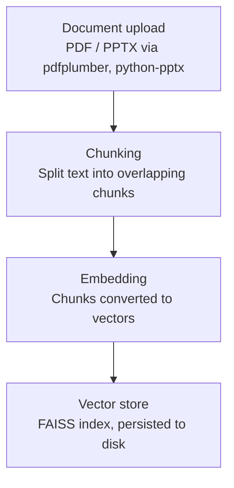
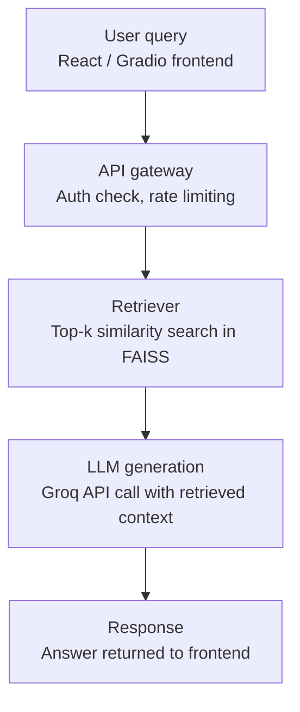
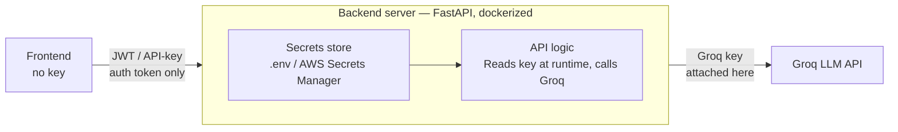

# Documentation Assistant

A RAG-based document Q&A chatbot — ask questions against a resume or document and get grounded answers, NotebookLM-style but intentionally minimal.

## Tech stack

- **Extraction**: `pdfplumber`, `python-pptx`
- **Vector store**: FAISS
- **Generation**: Groq / HuggingFace inference
- **Backend**: FastAPI
- **Frontend**: Gradio / React (minimal, capped scope)
- **Deployment**: HuggingFace Spaces (production), AWS EC2 (learning/resume exercise)

## Architecture overview

### 1. Ingestion pipeline

Runs once per uploaded document, before any query happens.



### 2. Query-time pipeline

Runs on every user request.



### 3. API key security

The frontend never sees the Groq API key. It only ever holds a session token (JWT / scoped API key) that proves the request is authorized to hit the backend. The backend is the only thing that reads the real key and attaches it server-side when calling Groq.



**Key practices:**
- API key is injected as a runtime environment variable (`docker run -e GROQ_API_KEY=...`) or pulled from AWS Secrets Manager on EC2 — never baked into the Docker image or committed to git.
- TLS termination happens at the edge (nginx / HF Spaces proxy) so auth tokens aren't sent in plaintext.
- `.env` is git-ignored; `.env.example` documents required variables without values.

## Deployment

| Environment | Host | Purpose |
|---|---|---|
| Production | HuggingFace Spaces | Public demo |
| Learning exercise | AWS EC2 + Docker + nginx | Resume / MLOps practice |

## Local development

```bash
# clone and install
git clone <repo-url>
cd dads-documentation-assistant
pip install -r requirements.txt

# set environment variables
cp .env.example .env   # add your GROQ_API_KEY

# run
uvicorn app.main:app --reload
```
