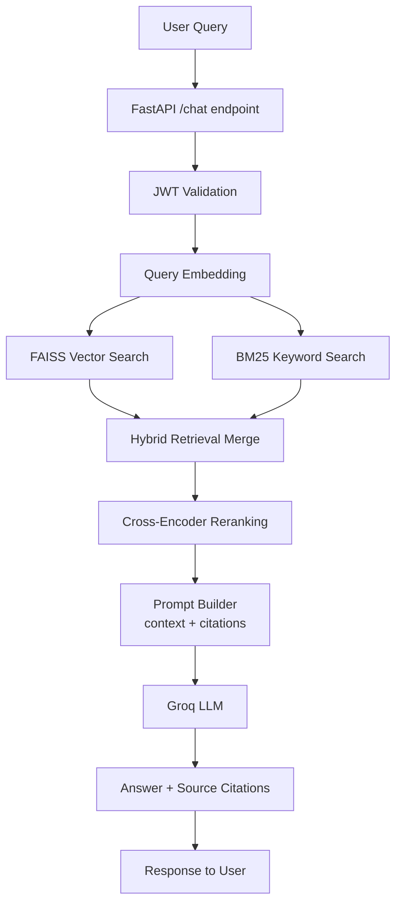
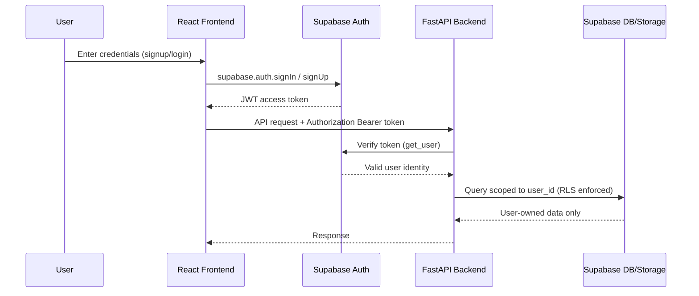
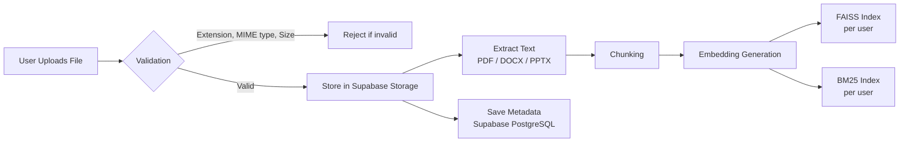
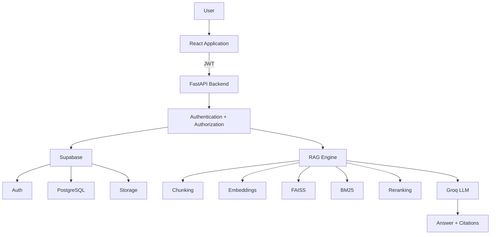

# RAG Assistant
 
A production-ready, multi-user Retrieval Augmented Generation (RAG) application that lets users upload documents, chat with them, and receive AI-generated answers with source citations.
 
The system combines semantic search, keyword retrieval, reranking, authentication, secure storage, and persistent vector indexes into a complete document intelligence pipeline.
 
---
 
## Features
 
### Authentication & User Management
- Secure signup/login using Supabase Authentication
- JWT-based authentication between frontend and backend
- User-isolated documents and conversations
- Protected API routes
### Document Management
- Upload PDF, DOCX, and PPTX files
- Secure document storage
- User-specific document access
- Persistent document metadata
- Source switching between documents
### RAG Pipeline
- Document text extraction
- Intelligent chunking
- Embedding generation
- FAISS vector similarity search
- BM25 keyword retrieval
- Hybrid retrieval (dense + sparse)
- Cross-encoder reranking
- Context-aware answer generation
- Source citations with page references
### Chat Features
- Chat with uploaded documents
- Persistent conversations
- Rename conversations
- Delete conversations
- Document-based chat filtering
### Security Features
- JWT authentication
- User ownership validation
- Supabase Row Level Security (RLS)
- Storage isolation
- File extension validation
- File size validation
- MIME type validation
- Rate limiting
- Prompt injection protection
- Environment-based secret management
---
 
## Architecture
 
### RAG Pipeline Flow (Query Path)
 

 
### Authentication Flow
 

 
### Document Upload Flow
 

 
### Final Architecture Summary
 

 
---
 
## Tech Stack
 
**Frontend**
- React
- TypeScript
- Tailwind CSS
- Supabase Client
**Backend**
- FastAPI
- Python
- Pydantic
**Database & Storage**
- Supabase PostgreSQL
- Supabase Storage
- Supabase Authentication
**AI / ML**
- FAISS
- BM25
- Sentence Transformers
- Cross-Encoder Reranking
- Groq LLM API
---
 
## Project Structure
 
```
RAG-assistant/
├── backend/
│   ├── main.py
│   ├── rag.py
│   ├── rag_manager.py
│   ├── document_loader.py
│   ├── chunker.py
│   ├── embedding.py
│   ├── vector_store.py
│   ├── bm25_store.py
│   ├── reranker.py
│   ├── prompt_builder.py
│   ├── llm.py
│   ├── auth.py
│   └── storage.py
│
├── frontend/
│   ├── src/
│   │   ├── components/
│   │   ├── pages/
│   │   ├── lib/
│   │   └── api.ts
│
├── requirements.txt
├── .env.example
└── README.md
```
 
---
 
## Local Setup
 
### Backend
 
```bash
# Create environment
python -m venv venv
 
# Activate
venv\Scripts\activate
 
# Install dependencies
pip install -r requirements.txt
 
# Create .env
SUPABASE_URL=
SUPABASE_SERVICE_KEY=
GROQ_API_KEY=
 
# Run
uvicorn main:app --reload
```
 
### Frontend
 
```bash
# Install dependencies
npm install
 
# Run
npm run dev
```
 
---
 
## API Overview
 
| Endpoint | Purpose |
|---|---|
| `POST /upload` | Upload documents |
| `GET /documents` | Retrieve user documents |
| `POST /chat` | Ask questions |
| `GET /documents/{id}/file` | Access document |
 
---
 
## Future Improvements
 
- Streaming responses
- OCR support for scanned PDFs
- Background document processing
- Advanced analytics
- Conversation memory improvements
---
 
## What I Learned Building This
 
- Designing a complete AI application architecture
- Building production RAG pipelines
- Authentication and authorization flows
- Vector databases and retrieval systems
- Hybrid search techniques
- Backend API design
- Secure document handling
- Deployment workflows
